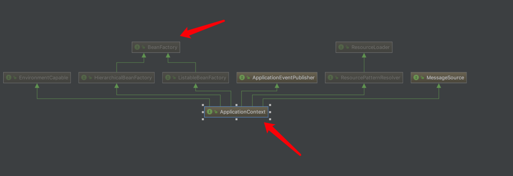
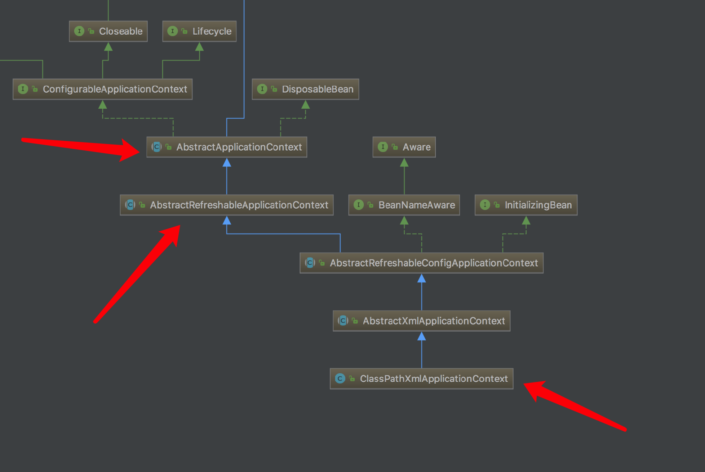
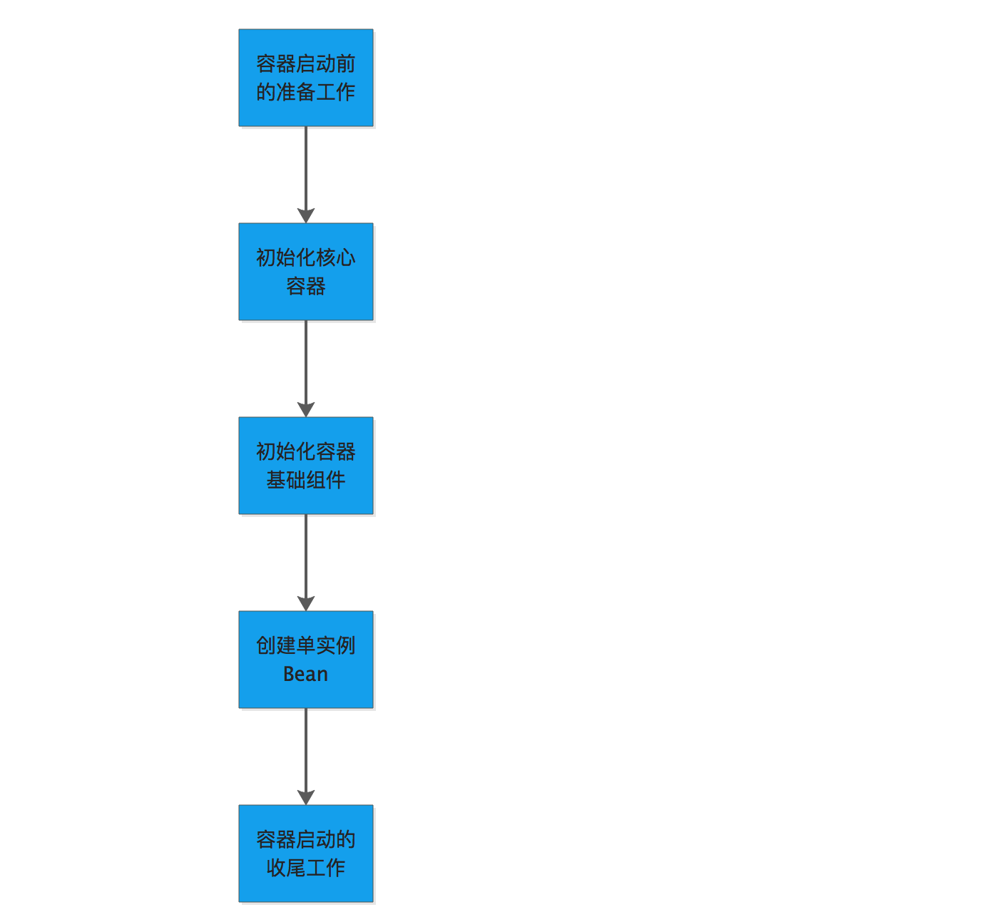

[Spring IOC容器启动流程源码解析(一)——容器概念详解及源码初探 ](https://www.cnblogs.com/takumicx/p/9757492.html)

目录

  - [1.1 IOC容器到底是什么](https://www.cnblogs.com/takumicx/p/9757492.html#11-ioc%E5%AE%B9%E5%99%A8%E5%88%B0%E5%BA%95%E6%98%AF%E4%BB%80%E4%B9%88)
  - [1.2 BeanFactory和ApplicationContext的联系以及区别](https://www.cnblogs.com/takumicx/p/9757492.html#12-beanfactory%E5%92%8Capplicationcontext%E7%9A%84%E8%81%94%E7%B3%BB%E4%BB%A5%E5%8F%8A%E5%8C%BA%E5%88%AB)
  - [1.3 解读IOC容器启动流程的意义](https://www.cnblogs.com/takumicx/p/9757492.html#13-%E8%A7%A3%E8%AF%BBioc%E5%AE%B9%E5%99%A8%E5%90%AF%E5%8A%A8%E6%B5%81%E7%A8%8B%E7%9A%84%E6%84%8F%E4%B9%89)
  - [1.4 如何有效的阅读源码](https://www.cnblogs.com/takumicx/p/9757492.html#14-%E5%A6%82%E4%BD%95%E6%9C%89%E6%95%88%E7%9A%84%E9%98%85%E8%AF%BB%E6%BA%90%E7%A0%81)
- [2. 初探IOC容器启动源码](https://www.cnblogs.com/takumicx/p/9757492.html#2-%E5%88%9D%E6%8E%A2ioc%E5%AE%B9%E5%99%A8%E5%90%AF%E5%8A%A8%E6%BA%90%E7%A0%81)
  - [2.1 启动容器的真正入口refresh()](https://www.cnblogs.com/takumicx/p/9757492.html#21-%E5%90%AF%E5%8A%A8%E5%AE%B9%E5%99%A8%E7%9A%84%E7%9C%9F%E6%AD%A3%E5%85%A5%E5%8F%A3refresh)
  - [2.2 容器启动流程的不同阶段](https://www.cnblogs.com/takumicx/p/9757492.html#22-%E5%AE%B9%E5%99%A8%E5%90%AF%E5%8A%A8%E6%B5%81%E7%A8%8B%E7%9A%84%E4%B8%8D%E5%90%8C%E9%98%B6%E6%AE%B5)
- [3 容器启动前的准备工作](https://www.cnblogs.com/takumicx/p/9757492.html#3-%E5%AE%B9%E5%99%A8%E5%90%AF%E5%8A%A8%E5%89%8D%E7%9A%84%E5%87%86%E5%A4%87%E5%B7%A5%E4%BD%9C)
- [4. 总结](https://www.cnblogs.com/takumicx/p/9757492.html#4-%E6%80%BB%E7%BB%93)

**1.1 IOC容器到底是什么**

IOC和AOP是Spring框架的核心功能,而IOC又是AOP实现的基础,因而可以说IOC是整个Spring框架的基石。那么什么是IOC？IOC即控制反转,通俗的说就是让Spring框架来帮助我们完成对象的依赖管理和生命周期控制等等工作。从面向对象的角度来说,具有这种行为,完成这种工作的主体就可以形象的称之为IOC容器。从代码角度来看,IOC容器不过是Spring中定义的具有IOC基本功能的一些类的统称,这些类都遵循一些共同的接口规范,所以我们可以说实现某些接口的具体的实现类就是IOC容器。而IOC容器的启动流程,说白了就是创建并初始化一个该实现类的实例的过程,在这个过程中要进行诸如配置文件的加载解析,核心组件的注册,bean 实例的创建等一系列繁琐复杂的操作,因而整个过程显得相对漫长,逻辑也相对复杂。

**1.2 BeanFactory和ApplicationContext的联系以及区别**

前面说到Spring中为容器类定义了一些接口规范,如下图所示

具体而言,Spring中的容器类可以分为两大类。

- 一类是由BeanFactory接口定义的核心容器。BeanFactory位于整个容器类体系结构的顶端,其基本实现类为DefaultListableBeanFactory。之所以称其为核心容器,是因为该类容器实现IOC的核心功能:比如配置文件的加载解析,Bean依赖的注入以及生命周期的管理等。BeanFactory作为Spring框架的基础设施,面向Spring框架本身,一般不会被用户直接使用。
- 另一类则是由ApplicationContext接口定义的容器,通常译为应用上下文,不过称其为应用容器可能更形象些。它在BeanFactory提供的核心IOC功能之上作了扩展。通常ApplicationContext的实现类内部都持有一个BeanFactory的实例,IOC容器的核心功能会交由它去完成。而ApplicationContext本身,则专注于在应用层对BeanFactory作扩展,比如提供对国际化的支持,支持框架级的事件监听机制以及增加了很多对应用环境的适配等。ApplicationContext面向的是使用Spring框架的开发者。开发中经常使用的ClassPathXmlApplicationContext就是典型的Spring的应用容器,也是要进行解读的IOC容器。

**1.3 解读IOC容器启动流程的意义**

- 1.IOC模块是整个Spring框架的核心,是实现其他模块的基础。IOC容器在启动时会注册并初始化Spring框架的所有基础组件,这些组件不仅在IOC模块中被用到,也会被AOP等模块使用。因而熟悉IOC容器的启动流程不仅是掌握IOC模块的关键,也是理解整个Spring框架的前提。
- 2.Spring是个很灵活的框架,允许用户在原有功能上进行扩展或者进行满足业务需求的个性化设置,比如对容器和Bean的生命周期过程进行增强,进行事件监听等等。要更好的使用Spring的这些特性,必须了解其工作原理,而答案就在IOC容器的启动过程中。
- 3.Spring框架在实现时使用了大量的设计模式,体现了很多优秀的设计思想。其IOC容器的启动源码就是供开发者学习这种设计经验的绝佳样板。

长求总:为了更好的理解和使用Spring框架并从它优秀的设计和实现经验中进行学习。

**1.4 如何有效的阅读源码**

Spring框架经过多年的发展,随着功能特性的增加,其实现也越来越复杂和抽象,要彻底弄清楚框架实现的每一个细节并不是一件简单的事。因而,对于Spring源码的解读,不必死抠每个方法和实现细节,这样太浪费时间,毕竟对于绝大分开发者而言,阅读Spring源码并不是为了成为Spring框架的开发者,而是为了更好的理解和使用Spring框架,或者从更高的角度,学习Spring的设计经验和思想,并将其运用到自己的项目实践中。
由于Spring容器的启动流程十分冗长,内容实在太多,全部放在一篇进行讲解实在太臃肿,也十分影响阅读体验。因而采取化整为零的策略,将整个IOC容器的启动流程划分为若干个阶段,每篇只对其中一个阶段进行详细讲解,因而对于容器启动源码的解读,主要抓住以下两个要点：

- 1.对容器启动流程的梳理
  容器启动流程分为哪几个阶段,在每个阶段容器做了哪些工作,初始化了哪些组件,执行了哪些用户自定义的回调函数。
- 2.对设计模式和设计思想的学习
  在实现这个功能时采用了哪些设计模式,遵循了哪些设计思想,这么做有哪些好处。

**2. 初探IOC容器启动源码**

本次源码阅读的Spring版本为4.3.10.RELEASE。

启动Spring容器,本质上是创建并初始化一个具体的容器类的过程,以常见的容器类ClassPathXmlApplicationContext为例,启动一个Spring容器可以用以下代码表示

ClassPathXmlApplicationContext ctx = new ClassPathXmlApplicationContext("applicationContext.xml");

尽管只有短短的一行代码,但已经创建并启动了一个Spring的IOC容器。为了后面更好的理解,先来看下ClassPathXmlApplicationContext的类继承结构

关键的几个类已经用红色箭头标注了出来。

- AbstractApplicationContext
  ApplicationContext接口的抽象实现类,能够自动检测并注册各种后置处理器(PostProcessor)和事件监听器(Listener),以模板方法模式定义了一些容器的通用方法,比如启动容器的真正方法refresh()就是在该类中定义的。
- AbstractRefreshableApplicationContext
  继承AbstractApplicationContext的抽象类。内部持有一个DefaultListableBeanFactory 的实例,使得继承AbstractRefreshableApplicationContext的Spring的应用容器内部默认有一个Spring的核心容器,那么Spring容器的一些核心功能就可以委托给内部的核心容器去完成。AbstractRefreshableApplicationContext在内部定义了创建,销毁以及刷新核心容器BeanFactory的方法。
- ClassPathXmlApplicationContext
  最常用的Spring的应用容器之一。在启动时会加载类路径下的xml文件作为容器的配置信息。

下面就正式开始容器启动流程的源码阅读
进入ClassPathXmlApplicationContext的构造方法,首先调用了重载构造函数
`/\*\*

\* Create a new ClassPathXmlApplicationContext, loading the definitions

\* from the given XML file and automatically refreshing the context.

\* @param configLocation resource location

\* @throws BeansException if context creation failed

\*/

public ClassPathXmlApplicationContext(String configLocation) throws BeansException {

this(new String[] {configLocation}, true, null);

}
`
这里有两点需要注意下:

- 1.创建ClassPathXmlApplicationContext时需要指定xml文件的路径作为参数,尽管我们在创建时只指定了一个,但其实可以同时指定多个。
- 2.Spring容器有父子容器的概念,通过HierarchicalBeanFactory接口定义了具有层级关系的容器体系。而在抽象实现类AbstractApplicationContext类的内部,有一个表示父容器的成员变量

`/\*\* Parent context \*/

private ApplicationContext parent;`

重载函数的第三个参数即表示要创建的ClassPathXmlApplicationContext的父容器,不过这里只需要设置为null。关于Spring的父子容器,还有一些独特的访问规则,子容器可以访问父容器中的Bean,父容器不可以访问子容器中的Bean。不知道这个规则在使用Spring做web开发时可能会碰到一些匪夷所思的问题。

继续跟进源码

`//设置父容器

super(parent);

//设置xml文件的路径参数

setConfigLocations(configLocations);

if (refresh) { //默认为true

//启动Spring容器

refresh();

}`

设置完父容器和xml文件的路径信息后,终于看到了refresh()方法,正如前面提到的,这是真正启动Spring容器的方法,想要知道Spring IOC容器的启动流程,就要知道该方法内部都做了什么。

**2.1 启动容器的真正入口refresh()**

refresh()是定义在AbstractApplicationContext类中的模板方法,定义了容器启动的基本流程,并留下钩子方法供子类进行扩展。

`@Override

public void refresh() throws BeansException, IllegalStateException {

synchronized (this.startupShutdownMonitor) {

// Prepare this context for refreshing.

prepareRefresh();

// Tell the subclass to refresh the internal bean factory.

ConfigurableListableBeanFactory beanFactory = obtainFreshBeanFactory();

// Prepare the bean factory for use in this context.

prepareBeanFactory(beanFactory);

try {

// Allows post-processing of the bean factory in context subclasses.

postProcessBeanFactory(beanFactory);

// Invoke factory processors registered as beans in the context.

invokeBeanFactoryPostProcessors(beanFactory);

// Register bean processors that intercept bean creation.

registerBeanPostProcessors(beanFactory);

// Initialize message source for this context.

initMessageSource();

// Initialize event multicaster for this context.

initApplicationEventMulticaster();

// Initialize other special beans in specific context subclasses.

onRefresh();

// Check for listener beans and register them.

registerListeners();

// Instantiate all remaining (non-lazy-init) singletons.

finishBeanFactoryInitialization(beanFactory);

// Last step: publish corresponding event.

finishRefresh();

}

catch (BeansException ex) {

if (logger.isWarnEnabled()) {

logger.warn("Exception encountered during context initialization - " +

"cancelling refresh attempt: " + ex);

}

// Destroy already created singletons to avoid dangling resources.

destroyBeans();

// Reset 'active' flag.

cancelRefresh(ex);

// Propagate exception to caller.

throw ex;

}

finally {

// Reset common introspection caches in Spring's core, since we

// might not ever need metadata for singleton beans anymore...

resetCommonCaches();

}

}

}`

启动容器的方法之所以用refresh(刷新)来命名,是为了形象的表达容器可以被重启这层含义。为了防止并发环境下多个线程同时启动IOC容器,整个过程使用同步代码块来进行同步。容器的启动从方法内容上来看并不复杂,流程也十分清晰,从方法名上大概就可以猜到每一步做了什么。

**2.2 容器启动流程的不同阶段**

为了更好的进行讲解,可以将容器启动的整个流程划分为以下五个阶段

**3 容器启动前的准备工作**

容器启动前的准备工作定义在下面的方法中

prepareRefresh();

进去一探究竟

`/\*\*

\* Prepare this context for refreshing, setting its startup date and

\* active flag as well as performing any initialization of property sources.

\*/

protected void prepareRefresh() {

//记录容器的启动时间

this.startupDate = System.currentTimeMillis();

//将容器的关闭标志置位false

this.closed.set(false);

//将容器的启动标记置位true

this.active.set(true);

if (logger.isInfoEnabled()) {

logger.info("Refreshing " + this);

}

// Initialize any placeholder property sources in the context environment

//空实现的钩子方法,供子类重写

initPropertySources();

// Validate that all properties marked as required are resolvable

// see ConfigurablePropertyResolver#setRequiredProperties

//对必须的系统环境变量进行校验,如果不存在将抛出异常

getEnvironment().validateRequiredProperties();

// Allow for the collection of early ApplicationEvents,

// to be published once the multicaster is available...

this.earlyApplicationEvents = new LinkedHashSet<ApplicationEvent>();

}`

首先记录了容器的启动时间和对容器的状态进行了标记。之后来到了容器为用户提供的第一个扩展点:

`initPropertySources();

protected void initPropertySources() {

// For subclasses: do nothing by default.

}`

这是一个默认空实现的钩子方法,用户在自定义IOC容器时可以重写,完成一些环境变量属性的初始化工作。
之后会对一些必要的环境变量信息进行校验

`getEnvironment().validateRequiredProperties();`

如果必须的环境变量信息不存在,则会抛出异常

`@Override

public void validateRequiredProperties() {

MissingRequiredPropertiesException ex = new MissingRequiredPropertiesException(); //异常信息集合

for (String key : this.requiredProperties) {

if (this.getProperty(key) == null) {

ex.addMissingRequiredProperty(key); //加入异常信息

}

}

if (!ex.getMissingRequiredProperties().isEmpty()) {

throw ex;  //抛出异常信息集合

}

}`

结合前面的钩子initPropertySources(),用户在自定义IOC容器时可以完成一些个性化需求,比如要求容器在启动时必须从环境变量中加载某属性值,若该属性值不存在则启动失败。重写initPropertySources()如下

`@Override

protected void initPropertySources() {

getEnvironment().setRequiredProperties("XXXX");

}`

若环境变量不存在则会抛出以下异常

总结下容器启动前的准备工作:主要是对容器状态进行标记,初始化环境变量信息并对必要的环境变量进行校验。

**4. 总结**

这篇文章的主要内容

- 1.讲解IOC容器的概念和类结构
- 2.找到容器启动流程的真正入口refresh()方法,将容器启动流程划分为了5个阶段:启动前的准备阶段,初始化核心容器阶段,初始化基础组件阶段,创建单实例bean阶段以及容器启动的收尾阶段
- 3.对容器启动前的准备阶段进行了源码解读

可以看到容器启动源码中对模板方法模式的合理运用。容器启动的流程以模板方法模式定义在了抽象容器类AbstractApplicationContext中,并留下了钩子函数供子类重写。用户实现自定义容器时,可以通过继承并重写钩子函数的方法对原有容器的功能进行扩展,而无需多做其他改动。这样既为用户扩展Spring容器开放了接口,又为用户屏蔽了容器实现的复杂性,很好的实现了Spring容器通用性和扩展性的统一。
